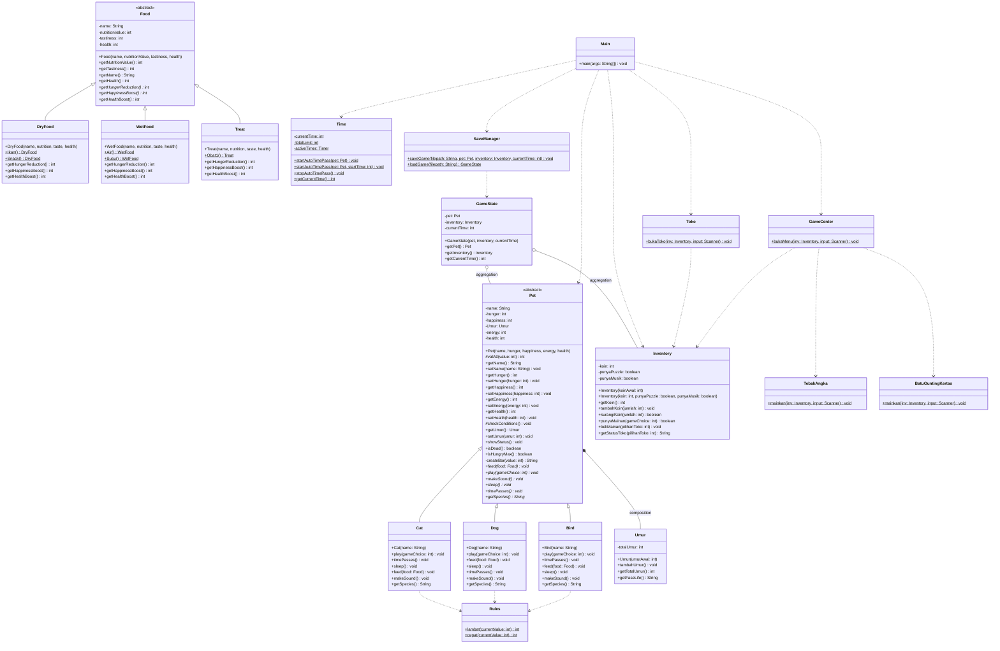

# 🐾 Pet Simulator Game (Java CLI)

[](https://www.oracle.com/java/)
[](#)
[](#)

**Pet Simulator** adalah game berbasis *Command-Line Interface* (CLI) yang ditulis dalam bahasa pemrograman Java. Game ini mensimulasikan perawatan hewan peliharaan (Kucing, Anjing, dan Burung) secara dinamis menggunakan mekanisme berjalannya waktu asinkron (*real-time auto time pass*), ekonomi permainan berbasis koin melalui minigame, serta sistem save & load game.

Projek ini dirancang untuk menerapkan pilar-pilar dasar **Pemrograman Berorientasi Objek (PBO)** secara mendalam dan bersih (*Clean Code*).

---

## 🚀 Fitur Utama

1. **Pemilihan Spesies Pet**: Pilih antara **Kucing**, **Anjing**, atau **Burung** yang memiliki karakteristik unik (suara, reaksi bermain, kebutuhan makanan, dan laju metabolisme).
2. **Real-Time Auto Time Pass (Detak Jantung Game)**: Game menggunakan thread asinkron (`java.util.Timer`) untuk mensimulasikan berjalannya waktu secara nyata. Atribut pet (Lapar, Bahagia, Energi, Umur) akan berubah secara otomatis setiap beberapa detik secara *real-time*.
3. **Fase Siklus Hidup**: Pet akan menua seiring berjalannya waktu, melewati fase kehidupan dari **Bayi**, **Remaja**, **Dewasa**, hingga **Tua**.
4. **Game Center (Minigames)**: Cari Koin dengan memainkan minigame seru seperti **Tebak Angka** dan **Batu Gunting Kertas**.
5. **Toko Mainan & Inventaris**: Belanjakan Koin untuk membeli mainan premium seperti **Puzzle Pintar** dan **Mainan Musikal** untuk meningkatkan kebahagiaan pet secara drastis.
6. **Sistem Aksi Pet Terpadu**: Beri makan (*Feed*), ajak bermain (*Play*), tidurkan (*Sleep*), dengarkan suara (*Make Sound*), dan pantau statistiknya (*Stat Pet*).
7. **Multi-Slot Save & Load Game**: Simpan progres game Anda ke dalam file teks (plaintext) di slot yang dipilih, dan muat kembali kapan saja untuk melanjutkan petualangan. Anda juga dapat berganti pet yang aktif di tengah permainan.

---

## 📂 Struktur Direktori Projek

Projek ini diatur secara modular ke dalam beberapa package terstruktur:

```text
ProjectPBOUAS/
├── food/                # Mengelola sistem makanan dan nutrisi pet
│   ├── Food.java        # Kelas induk abstrak (Abstract Class) untuk makanan
│   ├── DryFood.java     # Makanan kering (Ikan, Snack)
│   ├── WetFood.java     # Makanan basah/minuman (Air, Susu)
│   └── Treat.java       # Obat-obatan (Obat1)
├── game/                # Mengelola logika status game, minigame, & file save/load
│   ├── GameState.java   # Menyimpan snapshot status Pet & Inventory
│   ├── SaveManager.java # Menangani operasi I/O file save/load (savegame*.txt)
│   ├── GameCenter.java  # Menu utama minigame
│   ├── TebakAngka.java  # Logika minigame Tebak Angka
│   └── BatuGuntingKertas.java # Logika minigame Batu-Gunting-Kertas
├── inventory/           # Mengelola koin dan mainan yang dimiliki player
│   └── Inventory.java
├── pet/                 # Mengelola perilaku dan status hewan peliharaan
│   ├── Pet.java         # Kelas induk abstrak (Abstract Class) untuk Pet
│   ├── Cat.java         # Kelas konkret Kucing
│   ├── Dog.java         # Kelas konkret Anjing
│   └── Bird.java        # Kelas konkret Burung
├── rules/               # Mengatur logika matematika pengurangan atribut pet
│   └── Rules.java
├── shop/                # Mengelola interaksi pembelian mainan di toko
│   └── Toko.java
├── time/                # Mengatur thread asinkron untuk simulasi waktu nyata
│   └── Time.java
├── umur/                # Mengelola fase siklus hidup pet berdasarkan usia
│   └── Umur.java
├── Main.java            # Entry point utama aplikasi (Menu Utama & Gameplay Loop)
├── doc.md               # Laporan detail projek
└── savegame*.txt        # File penyimpanan data game (digenerate otomatis)
```

---

## 🛠️ Cara Menjalankan

### Persyaratan Sistem
* **Java Development Kit (JDK)** versi 8 atau yang lebih baru.

### Langkah-Langkah

1. **Buka direktori projek** di terminal Anda:
   ```bash
   cd /path/to/ProjectPBOUAS
   ```

2. **Kompilasi seluruh berkas Java**:
   Karena projek ini menggunakan package-package yang saling bergantung, kompilasi entry point utama (`Main.java`) bersama dengan folder package-nya:
   ```bash
   javac Main.java food/*.java game/*.java inventory/*.java pet/*.java rules/*.java shop/*.java time/*.java umur/*.java
   ```

   > [!TIP]
   > Jika terdapat *error* saat melakukan kompilasi (*compile*), hapus berkas `.class` yang sudah terbuat terlebih dahulu sebelum mencoba kompilasi ulang:
   > * **Linux/macOS**:
   >   ```bash
   >   rm -f *.class */*.class
   >   ```
   > * **Windows (Command Prompt)**:
   >   ```cmd
   >   del /s *.class
   >   ```
   > * **Windows (PowerShell)**:
   >   ```powershell
   >   Get-ChildItem -Recurse -Filter *.class | Remove-Item
   >   ```

3. **Jalankan Aplikasi**:
   Kompilasi `Main.java` terlebih dahulu, kemudian jalankan program:
   ```bash
   javac Main.java
   java Main
   ```

---

## 📊 Hubungan Kelas (Class Diagram)

Berikut adalah visualisasi hubungan antar kelas menggunakan diagram **Mermaid**:



---

## 🧩 Penerapan Konsep Pemrograman Berorientasi Objek (PBO)

### 1. Abstraksi (Abstraction)
Abstraksi menyembunyikan detail logika yang rumit dan mendefinisikan antarmuka/template mendasar.
*   **[Pet.java](file:///Users/f0ursecond/Documents/college/ProjectPBOUAS/pet/Pet.java)**: Kelas induk abstrak untuk hewan peliharaan yang mendeklarasikan perilaku wajib (`feed`, `play`, `makeSound`, `sleep`, `timePasses`, `getSpecies`) tanpa mengimplementasikannya secara langsung.
*   **[Food.java](file:///Users/f0ursecond/Documents/college/ProjectPBOUAS/food/Food.java)**: Kelas induk abstrak untuk makanan yang mengharuskan sub-kelas menentukan kontribusi nutrisi lewat method abstrak `getHungerReduction()`, `getHappinessBoost()`, dan `getHealthBoost()`.

### 2. Pewarisan (Inheritance)
Pewarisan digunakan untuk mewarisi kode dari kelas induk ke anak kelas agar terhindar dari pengulangan kode (*reusability*).
*   **[Cat.java](file:///Users/f0ursecond/Documents/college/ProjectPBOUAS/pet/Cat.java)**, **[Dog.java](file:///Users/f0ursecond/Documents/college/ProjectPBOUAS/pet/Dog.java)**, dan **[Bird.java](file:///Users/f0ursecond/Documents/college/ProjectPBOUAS/pet/Bird.java)** mewarisi semua atribut dan metode dasar dari **[Pet.java](file:///Users/f0ursecond/Documents/college/ProjectPBOUAS/pet/Pet.java)** menggunakan kata kunci `extends`.
*   **[DryFood.java](file:///Users/f0ursecond/Documents/college/ProjectPBOUAS/food/DryFood.java)**, **[WetFood.java](file:///Users/f0ursecond/Documents/college/ProjectPBOUAS/food/WetFood.java)**, dan **[Treat.java](file:///Users/f0ursecond/Documents/college/ProjectPBOUAS/food/Treat.java)** mewarisi struktur dari **[Food.java](file:///Users/f0ursecond/Documents/college/ProjectPBOUAS/food/Food.java)**.

### 3. Polimorfisme (Polymorphism)
Polimorfisme memungkinkan objek mengambil berbagai bentuk tindakan:
*   **Dynamic Polymorphism (Method Overriding)**:
    *   **Suara Pet (`makeSound()`)**: Kucing bersuara *"Miawww"*, Anjing *"Rawrrrrr"*, Burung *"Cuitttt"*.
    *   **Favorit Bermain (`play()`)**: Kucing mendapat kepuasan besar dari *Titik Laser* (+25), Anjing dari *Tangkap Bola* (+25), dan Burung dari *Rintangan Udara* (+25).
*   **Dynamic Binding (Polimorfisme Acuan)**: Penggunaan tipe superclass untuk merujuk ke objek subclass saat program berjalan:
    ```java
    Pet myPet = null;
    switch (pilihan) {
        case 1: myPet = new Cat(name); break;
        case 2: myPet = new Dog(name); break;
        case 3: myPet = new Bird(name); break;
    }
    // Pemanggilan metode terikat dinamis tergantung objek nyata yang dibuat
    myPet.showStatus();
    ```

### 4. Enkapsulasi (Encapsulation)
Menjaga keamanan data dan membatasi manipulasi langsung atribut objek.
*   Seluruh atribut sensitif dideklarasikan dengan modifier `private` (seperti `hunger`, `happiness`, `energy`, `health`).
*   Akses nilai variabel hanya diperbolehkan melalui method **Getter** dan **Setter** publik yang terkontrol.
*   Setter menyertakan logika **Validasi** (`valAtt`) untuk menjaga nilai atribut pet tetap dalam batas `0` s.d `100`:
    ```java
    public void setHunger(int hunger) { 
        this.hunger = valAtt(hunger); 
    }
    
    protected int valAtt(int value) {
        if (value < 0) return 0;
        if (value > 100) return 100;
        return value;
    }
    ```

---

## ⚙️ Logika Game & Mekanika Teknis

### A. Real-Time Auto Time Pass (Simulasi Waktu Nyata)
Alur waktu diatur oleh kelas **[Time.java](file:///Users/f0ursecond/Documents/college/ProjectPBOUAS/time/Time.java)** secara asinkron menggunakan thread di latar belakang (`java.util.Timer`).
Setiap jenis pet memiliki interval waktu metabolisme yang berbeda:
*   **Anjing**: Mengalami penyusutan status setiap **10 detik** (Batas sesi bermain: 120 detik).
*   **Kucing**: Mengalami penyusutan status setiap **15 detik** (Batas sesi bermain: 140 detik).
*   **Burung**: Mengalami penyusutan status setiap **20 detik** (Batas sesi bermain: 85 detik).

Ketika waktu berlalu, tingkat kelaparan pet meningkat (+10), energi menyusut, kebahagiaan berkurang, dan umurnya bertambah secara berkala. Perhitungan laju penyusutan ini memanfaatkan kelas pembantu **[Rules.java](file:///Users/f0ursecond/Documents/college/ProjectPBOUAS/rules/Rules.java)**.

### B. Ekonomi Game & Mainan Premium
*   Pemain dibekali modal awal **1000 Koin**.
*   **Minigames**:
    *   **Tebak Angka**: Tebak angka rahasia 1-5 (+50 Koin jika benar, +10 Koin partisipasi jika salah).
    *   **Batu Gunting Kertas**: Bertanding melawan bot (+40 Koin jika menang, +15 Koin jika seri, +5 Koin partisipasi jika kalah).
*   **Toko Mainan**: Pemain bisa membeli mainan premium seperti **Puzzle Pintar** dan **Mainan Musikal** seharga **150 Koin**. Memiliki mainan premium akan membuka opsi bermain khusus di menu aksi yang memberikan bonus kebahagiaan sangat tinggi bagi pet kesayangan Anda.

### C. Batasan Keadaan Pet
*   **Kelaparan Ekstrem**: Jika tingkat kelaparan menyentuh angka `100`, status pet berubah menjadi `[KELAPARAN]`. Pemain akan **dikunci** dari seluruh aksi kecuali memberi makan (*Feed*).
*   **Sakit / Pengurangan Kesehatan**: Jika rasa lapar bertahan di level kritis (`hunger >= 90`), kesehatan pet (`health`) akan terpangkas 5 poin setiap interval waktu berjalan.
*   **Kematian (Game Over)**: Jika kesehatan pet mencapai `0`, statusnya menjadi `[MATI]`. Interaksi ditiadakan, dan pemain harus memuat slot game lain atau membuat pet baru.

---

## 💾 Mekanisme Save dan Load Game

Sistem penyimpanan data game dikelola oleh **[SaveManager.java](file:///Users/f0ursecond/Documents/college/ProjectPBOUAS/game/SaveManager.java)** dengan menulis atau membaca file plaintext (`savegame1.txt` / `savegame2.txt`). 

### Struktur Format File Save:
```text
[Baris 1] Spesies Pet (Kucing/Anjing/Burung)
[Baris 2] Nama Pet
[Baris 3] Tingkat Kelaparan (Hunger)
[Baris 4] Tingkat Kebahagiaan (Happiness)
[Baris 5] Tingkat Energi (Energy)
[Baris 6] Tingkat Kesehatan (Health)
[Baris 7] Total Umur Pet
[Baris 8] Jumlah Koin Player
[Baris 9] Kepemilikan Puzzle Pintar (true/false)
[Baris 10] Kepemilikan Mainan Musikal (true/false)
[Baris 11] Waktu Sesi Terakhir (Detik)
```
Dengan struktur modular dan pemanfaatan `BufferedReader` / `BufferedWriter`, game dapat memulihkan status objek secara presisi tanpa ada kehilangan data.
