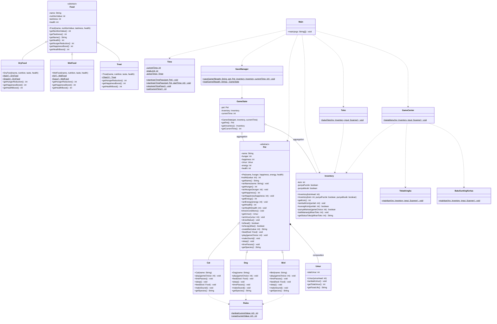

# LAPORAN PROJEK AKHIR
## PEMROGRAMAN BERORIENTASI OBJEK (PBO): PET SIMULATOR GAME

---

## 1. DESKRIPSI UMUM PROJEK
**Pet Simulator** adalah sebuah aplikasi berbasis command-line interface (CLI) yang ditulis dalam bahasa pemrograman Java. Aplikasi ini mensimulasikan kepemilikan dan perawatan hewan peliharaan (Pet). Pemain dapat memilih jenis hewan (Kucing, Anjing, atau Burung), memberi makan, bermain, menidurkan, mendengarkan suaranya, serta melatih mereka. 

Untuk menambah aspek permainan (gamification), terdapat fitur **Koin** yang dapat diperoleh melalui berbagai minigame di **Game Center** (seperti Tebak Angka dan Batu-Gunting-Kertas). Koin tersebut dapat dibelanjakan di **Toko Mainan** untuk membeli mainan premium (seperti Puzzle Pintar atau Mainan Musikal), yang memberikan bonus kebahagiaan lebih besar bagi hewan peliharaan.

Aplikasi ini juga dilengkapi dengan mekanisme **Auto Time Pass (Detak Jantung Game)** menggunakan `java.util.Timer` yang berjalan secara asinkron (background thread). Mekanisme ini mensimulasikan berjalannya waktu secara nyata, di mana status lapar, kebahagiaan, energi, dan umur pet akan terbarui secara otomatis setiap beberapa detik berdasarkan spesiesnya. Pemain juga dapat menyimpan progress permainan mereka (*Save Game*) dan memuatnya kembali (*Load Game*).

---

## 2. STRUKTUR FOLDER & BERKAS PROJEK
Projek ini dibagi ke dalam beberapa paket (package) terstruktur untuk menerapkan prinsip kerapian kode (clean code) dan modularitas:

*   [Main.java](file:///Users/f0ursecond/Documents/college/ProjectPBOUAS/Main.java) (Entry point aplikasi)
*   **`pet/`**: Berisi kelas dasar abstrak dan implementasi konkret hewan peliharaan
    *   [Pet.java](file:///Users/f0ursecond/Documents/college/ProjectPBOUAS/pet/Pet.java) (Abstract Class)
    *   [Cat.java](file:///Users/f0ursecond/Documents/college/ProjectPBOUAS/pet/Cat.java) (Concrete Class)
    *   [Dog.java](file:///Users/f0ursecond/Documents/college/ProjectPBOUAS/pet/Dog.java) (Concrete Class)
    *   [Bird.java](file:///Users/f0ursecond/Documents/college/ProjectPBOUAS/pet/Bird.java) (Concrete Class)
*   **`food/`**: Berisi sistem makanan dan nutrisi pet
    *   [Food.java](file:///Users/f0ursecond/Documents/college/ProjectPBOUAS/food/Food.java) (Abstract Class)
    *   [DryFood.java](file:///Users/f0ursecond/Documents/college/ProjectPBOUAS/food/DryFood.java) (Concrete Class)
    *   [WetFood.java](file:///Users/f0ursecond/Documents/college/ProjectPBOUAS/food/WetFood.java) (Concrete Class)
    *   [Treat.java](file:///Users/f0ursecond/Documents/college/ProjectPBOUAS/food/Treat.java) (Concrete Class)
*   **`inventory/`**: Mengelola aset pemain
    *   [Inventory.java](file:///Users/f0ursecond/Documents/college/ProjectPBOUAS/inventory/Inventory.java) (Concrete Class)
*   **`shop/`**: Mengelola pembelian item
    *   [Toko.java](file:///Users/f0ursecond/Documents/college/ProjectPBOUAS/shop/Toko.java) (Concrete Class)
*   **`game/`**: Mengelola status game, sistem save/load, dan minigame
    *   [GameState.java](file:///Users/f0ursecond/Documents/college/ProjectPBOUAS/game/GameState.java) (Concrete Class)
    *   [SaveManager.java](file:///Users/f0ursecond/Documents/college/ProjectPBOUAS/game/SaveManager.java) (Concrete Class)
    *   [GameCenter.java](file:///Users/f0ursecond/Documents/college/ProjectPBOUAS/game/GameCenter.java) (Concrete Class)
    *   [TebakAngka.java](file:///Users/f0ursecond/Documents/college/ProjectPBOUAS/game/TebakAngka.java) (Concrete Class)
    *   [BatuGuntingKertas.java](file:///Users/f0ursecond/Documents/college/ProjectPBOUAS/game/BatuGuntingKertas.java) (Concrete Class)
*   **`time/`**: Mengatur jalannya waktu asinkron
    *   [Time.java](file:///Users/f0ursecond/Documents/college/ProjectPBOUAS/time/Time.java) (Concrete Class)
*   **`rules/`**: Menyimpan perhitungan matematis dan aturan pengurangan atribut pet
    *   [Rules.java](file:///Users/f0ursecond/Documents/college/ProjectPBOUAS/rules/Rules.java) (Concrete Class)
*   **`umur/`**: Mengelola siklus fase kehidupan pet
    *   [Umur.java](file:///Users/f0ursecond/Documents/college/ProjectPBOUAS/umur/Umur.java) (Concrete Class)

---

## 3. CLASS DIAGRAM & HIERARKI KELAS
Hierarki kelas dan hubungan antar-kelas dalam projek ini dapat divisualisasikan melalui diagram kelas di bawah ini:



### Penjelasan Hubungan Antar Kelas:
1.  **Inheritance (Pewarisan / Generalisasi)**:
    *   `Cat`, `Dog`, dan `Bird` mewarisi kelas dasar `Pet` (`extends Pet`). Hal ini ditandai dengan garis panah dengan kepala panah kosong `<|--`.
    *   `DryFood`, `WetFood`, dan `Treat` mewarisi kelas dasar `Food` (`extends Food`).
2.  **Composition (Komposisi)**:
    *   Kelas `Pet` memiliki hubungan erat dengan kelas `Umur` (`Pet *-- Umur`). Objek `Umur` diinstansiasi di dalam konstruktor kelas `Pet` dan tidak dapat berdiri sendiri di luar siklus hidup objek `Pet`.
3.  **Aggregation (Agregasi)**:
    *   Kelas `GameState` mengelompokkan objek `Pet` dan `Inventory` (`GameState o-- Pet`, `GameState o-- Inventory`). Relasi ini bersifat longgar karena objek `Pet` dan `Inventory` dapat hidup secara mandiri meskipun objek `GameState` dihancurkan.
4.  **Dependency (Ketergantungan)**:
    *   Kelas `Main` bergantung pada `Pet`, `Inventory`, `Time`, `Toko`, `GameCenter`, dan `SaveManager` untuk mengontrol alur permainan utama. Hubungan ketergantungan ini digambarkan dengan garis putus-putus (`..>`).

---

## 4. PENJELASAN IMPLEMENTASI KONSEP OOP
Projek Pet Simulator ini dirancang dengan menerapkan empat pilar utama Pemrograman Berorientasi Objek (OOP) secara komprehensif:

### A. Abstraksi (Abstraction)
Abstraksi digunakan untuk menyembunyikan detail implementasi yang rumit dan hanya menyajikan antarmuka (interface) penting kepada pengguna. Dalam projek ini, abstraksi diterapkan melalui kelas abstrak (**Abstract Class**):

1.  **Abstract Class `Pet`**:
    Mendefinisikan atribut umum seperti `name`, `hunger`, `happiness`, `energy`, `health`, dan `Umur`. Kelas ini juga mendeklarasikan metode-metode abstrak yang harus diimplementasikan oleh setiap hewan secara spesifik:
    ```java
    public abstract class Pet {
        // ...
        public abstract void feed(Food food);
        public abstract void play(int gameChoice); 
        public abstract void makeSound();
        public abstract void sleep();
        public abstract void timePasses();
        public abstract String getSpecies();
    }
    ```
2.  **Abstract Class `Food`**:
    Digunakan sebagai templat untuk mendefinisikan makanan dengan metode abstrak pengubah atribut:
    ```java
    public abstract class Food {
        // ...
        public abstract int getHungerReduction();
        public abstract int getHappinessBoost();
        public abstract int getHealthBoost();
    }
    ```

> [!NOTE]
> Dengan kelas abstrak, kelas `Main` hanya perlu memanggil metode seperti `myPet.makeSound()` atau `myPet.feed(makanan)` tanpa perlu mengetahui logika internal pemrosesan masing-masing spesies pet atau jenis makanan.

---

### B. Pewarisan (Inheritance)
Pewarisan memungkinkan pembuatan kelas baru (subclass/child class) yang mewarisi seluruh atribut dan metode dari kelas yang sudah ada (superclass/parent class). Ini meningkatkan *reusability* kode (penggunaan kembali kode yang sudah ditulis).

1.  **Pewarisan Kelas `Pet`**:
    Kelas `Cat`, `Dog`, dan `Bird` mewarisi properti dari `Pet` melalui kata kunci `extends`.
    ```java
    public class Cat extends Pet {
        public Cat(String name) {
            super(name, 50, 50, 50, 50); // Memanggil konstruktor superclass Pet
        }
        // ...
    }
    ```
2.  **Pewarisan Kelas `Food`**:
    Kelas `DryFood`, `WetFood`, dan `Treat` merupakan turunan dari kelas `Food` dan mewarisi konstruktor serta metode pengakses nutrisinya.
    ```java
    public class DryFood extends Food {
        public DryFood(String name, int nutrition, int taste, int health) {
            super(name, nutrition, taste, health);
        }
        // ...
    }
    ```

---

### C. Polimorfisme (Polymorphism)
Polimorfisme memungkinkan suatu objek untuk memiliki banyak bentuk. Pada projek ini, terdapat dua jenis polimorfisme:

1.  **Polimorfisme Dinamis (Method Overriding)**:
    Subclass mengganti implementasi metode dari superclass untuk memberikan perilaku yang unik.
    *   Metode `makeSound()` dideklarasikan abstrak di kelas `Pet`, lalu di-*override* di masing-masing subclass:
        *   `Cat`: `System.out.println("Miawww");`
        *   `Dog`: `System.out.println("Rawrrrrr");`
        *   `Bird`: `System.out.println("Cuitttt");`
    *   Metode `play()` di-*override* agar masing-masing hewan memiliki reaksi berbeda terhadap mainan:
        *   Kucing lebih menyukai titik laser (pilihan `2`) sehingga mendapat bonus kebahagiaan besar (+25).
        *   Anjing sangat menyukai tangkap bola (pilihan `1`) sehingga mendapat bonus kebahagiaan besar (+25).
        *   Burung sangat menyukai rintangan udara (pilihan `3`) sehingga mendapat bonus kebahagiaan besar (+25).

2.  **Polimorfisme Acuan (Dynamic Binding)**:
    Variabel referensi dari tipe superclass digunakan untuk merujuk pada objek dari subclass. Hal ini terlihat pada inisialisasi di kelas `Main`:
    ```java
    Pet myPet = null;
    // ...
    switch (hewan) {
        case 1: myPet = new Cat(name); break; // Upcasting
        case 2: myPet = new Dog(name); break; // Upcasting
        case 3: myPet = new Bird(name); break; // Upcasting
    }
    // ...
    myPet.showStatus(); // Memanggil metode secara dinamis tergantung tipe objek nyata
    ```

---

### D. Enkapsulasi (Encapsulation)
Enkapsulasi adalah teknik untuk membungkus data (atribut) dan metode yang beroperasi pada data tersebut dalam satu unit (kelas), serta membatasi akses langsung dari luar kelas. Tujuannya adalah menyembunyikan status internal objek dan menjaga integritas data.

1.  **Penerapan Akses Modifier**:
    Semua atribut di kelas `Pet`, `Food`, `Inventory`, `GameState`, dan `Umur` dideklarasikan dengan kata kunci `private`.
2.  **Getter dan Setter**:
    Akses ke atribut privat dilayani oleh metode publik Getter dan Setter.
3.  **Validasi Data**:
    Metode Setter menyertakan logika validasi untuk mencegah nilai yang tidak valid (misalnya nilai atribut pet berada di luar rentang `0` sampai `100`):
    ```java
    public abstract class Pet {
        private int hunger;
        // ...
        public int getHunger() { return hunger; }
        public void setHunger(int hunger) { this.hunger = valAtt(hunger); }

        protected int valAtt(int value) {
            if (value < 0) return 0;
            if (value > 100) return 100;
            return value;
        }
    }
    ```

> [!IMPORTANT]
> Dengan enkapsulasi, objek luar tidak bisa secara bebas melakukan manipulasi langsung seperti `myPet.health = -999`. Segala bentuk perubahan status harus melalui perantara metode publik yang terkontrol.

---

## 5. PENJELASAN FITUR PENUNJANG
Selain konsep OOP dasar, projek ini juga memanfaatkan beberapa fitur penunjang lanjutan:

### A. Mekanisme Asinkron Waktu Nyata (Auto Time Pass)
Kelas `Time` menggunakan kelas bawaan Java `Timer` dan `TimerTask` untuk membuat penghitung waktu (timer) asinkron yang berjalan di latar belakang:
*   Timer ini memanggil metode `pet.timePasses()` setiap interval tertentu untuk memperbarui status (menambah lapar, mengurangi kebahagiaan, memotong energi, dan menambah umur).
*   Interval waktu pembaruan status didefinisikan secara polimorfis berdasarkan spesies pet:
    *   **Anjing**: Status ter-update setiap **10 detik**.
    *   **Kucing**: Status ter-update setiap **15 detik**.
    *   **Burung**: Status ter-update setiap **20 detik**.
*   Hal ini memodelkan metabolisme hewan yang berbeda-beda secara dinamis.

### B. Aturan Pengurangan Atribut Berbasis `Rules.java`
Pengurangan atribut dihitung secara dinamis menggunakan persentase dengan rumus matematika yang disimpan di kelas `Rules`. Ini menerapkan prinsip pemisahan tanggung jawab (*separation of concerns*):
*   `Rules.lambat(currentValue)`: memotong atribut sebanyak 5% dari nilai saat ini (misalnya untuk pemotongan energi kucing yang bergerak lambat).
*   `Rules.cepat(currentValue)`: memotong/menambah atribut sebanyak 20% (misalnya untuk anjing yang hiperaktif atau metabolisme burung yang cepat).

### C. Sistem Save dan Load Game (`SaveManager.java`)
*   Data permainan disimpan dalam bentuk file teks biasa (*plaintext file*).
*   Proses penulisan file menggunakan `BufferedWriter` dan `FileWriter` untuk menyimpan status pet saat ini (spesies, nama, hunger, happiness, energy, health, umur, koin, kepemilikan mainan, dan waktu berjalan).
*   Proses pembacaan file menggunakan `BufferedReader` dan `FileReader` untuk mengonstruksi ulang objek pet dan inventory secara presisi saat dimuat kembali (*load game*).

---

## 6. KESIMPULAN
Projek **Pet Simulator Game** telah berhasil dirancang dan diimplementasikan menggunakan kaidah Pemrograman Berorientasi Objek (PBO) yang baik dan benar. Melalui pengorganisasian kode ke dalam beberapa package, enkapsulasi ketat pada setiap variabel instansi, pemanfaatan pewarisan untuk menghindari redundansi kode, abstraksi templat kelas, serta penerapan polimorfisme dinamis, kode program menjadi sangat modular, mudah dibaca, mudah dikembangkan (*maintainable*), dan bebas dari error kompilasi maupun eksekusi.
